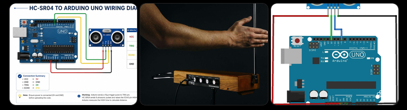
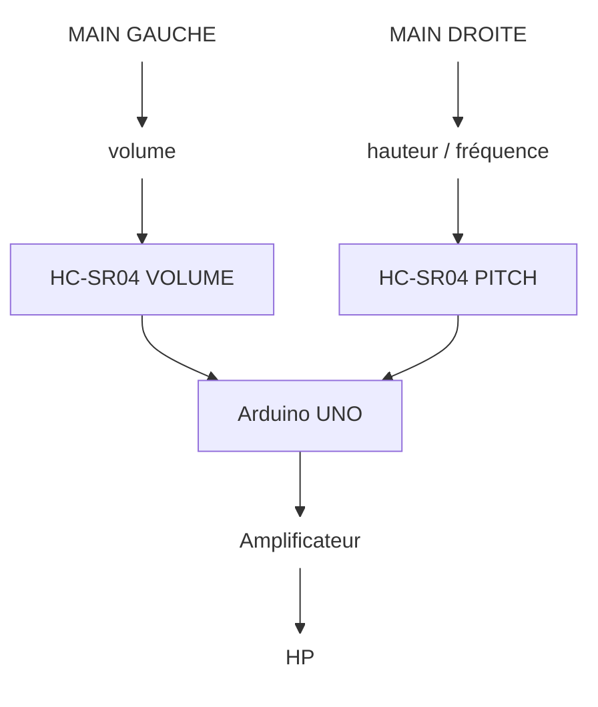
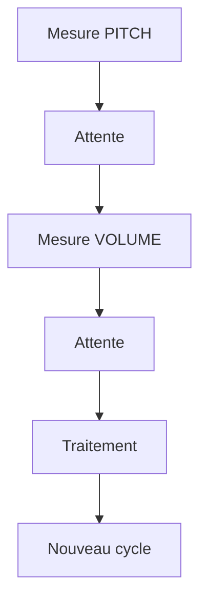
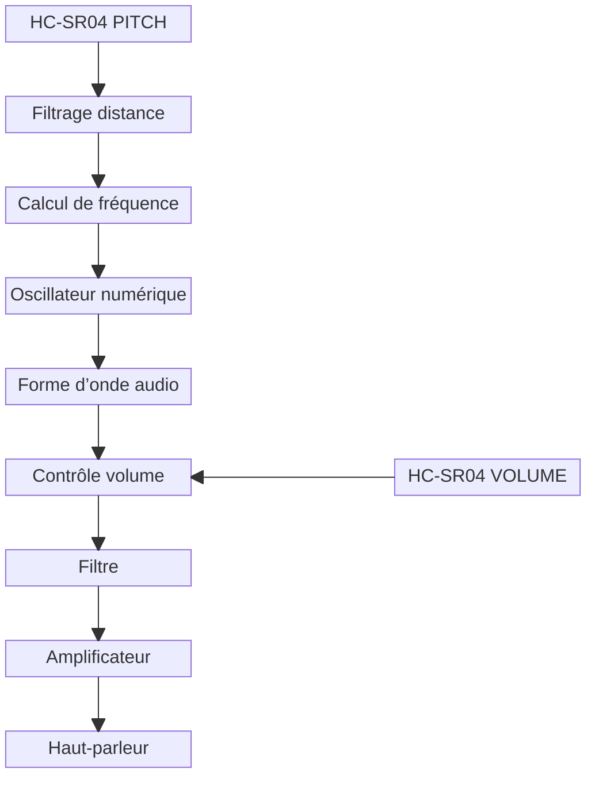
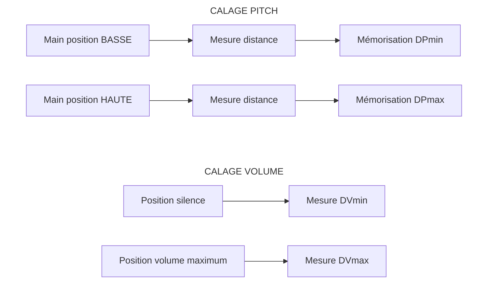
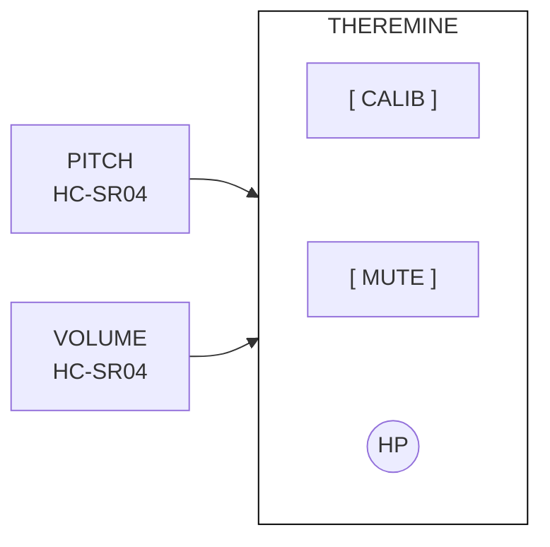
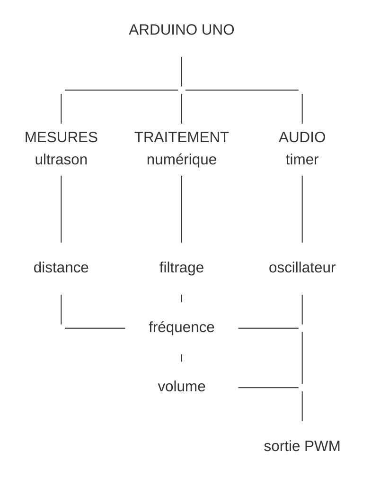

<style>
    .verif {
        border: 10px solid red;
        display: initial;
    }
</style>

<script>
    document.addEventListener("DOMContentLoaded", () => {
        const params = new URLSearchParams(window.location.search);

        if (!params.has("verif")) {
            params.set("verif", "false");
            const query = params.toString();
            window.history.replaceState(
                null,
                "",
                `${window.location.pathname}?${query}${window.location.hash}`
            );
        }

        const visible = params.get("verif").toLowerCase() === "true";
        document.querySelectorAll(".verif").forEach((element) => {
            element.style.display = visible ? "initial" : "none";
        });
    });
</script>

> THÉRÉMINE ULTRASONIQUE
> : Arduino Uno + deux transducteurs HC-SR04
> : Jean-Pierre Broillet septembre 2026
> : Étude, câblage, calibration et programme C++ documenté
> : Projet expérimental d’un instrument électronique sans contact



## 1. Objet du projet

Le but est de réaliser un thérémine numérique avec un Arduino Uno et deux capteurs ultrasonores HC-SR04. Un capteur mesure la position d’une main pour commander la hauteur du son (pitch), tandis que le second commande le volume. Contrairement au thérémine historique, qui exploite la variation de capacité créée par les mains à proximité d’antennes radiofréquences, cette réalisation mesure directement des distances.

C’est aussi un instrument difficile à maîtriser, car le musicien ne dispose d’aucun repère physique pour placer ses notes.

L’intérêt pédagogique est important : acquisition ultrasonore, filtrage numérique, conversion d’une grandeur physique en paramètre musical, temporisation, génération audio et amplification.

Une virtuose du thérémine :

<div class="youtube-embed">
<iframe width="560" height="315" src="https://www.youtube.com/embed/lY7sXKGZl2w?si=1b4cQyzCR3A848Id" title="YouTube video player" frameborder="0" allow="accelerometer; autoplay; clipboard-write; encrypted-media; gyroscope; picture-in-picture; web-share" referrerpolicy="strict-origin-when-cross-origin" allowfullscreen></iframe>
</div>

## 2. Architecture générale





Les deux capteurs doivent être suffisamment séparés et, si possible, orientés selon des axes différents. Cela diminue les risques qu’un HC-SR04 reçoive l’écho de l’impulsion émise par l’autre.

## 3. Composants proposés

| Quantité | Composant                                                                            | Remarques                             |
| :------: | :----------------------------------------------------------------------------------- | :------------------------------------ |
|    1     | Arduino Uno                                                                          |                                       |
|    2     | HC-SR04                                                                              |                                       |
|    1     | Petit amplificateur audio                                                            | LM386 ou module équivalent recommandé |
|    1     | Haut-parleur 8 Ω                                                                     |                                       |
|    1     | Bouton-poussoir CALIBRATION                                                          | Évolution recommandée                 |
|    1     | Bouton-poussoir MUTE                                                                 | Évolution recommandée                 |
|    —     | Résistances, condensateurs de découplage, plaque d’essai et alimentation 5 V adaptée |                                       |

## 4. Affectation des broches

| Fonction             | Arduino Uno |
| :------------------- | :---------: |
| TRIG HC-SR04 Pitch   |     D7      |
| ECHO HC-SR04 Pitch   |     D8      |
| TRIG HC-SR04 Volume  |     D9      |
| ECHO HC-SR04 Volume  |     D10     |
| Sortie audio         |     D3      |
| Alimentation HC-SR04 |    +5 V     |
| Masse                |     GND     |

## 5. Schéma électrique de base



Important : ne pas brancher directement un haut-parleur de 8 Ω sur une sortie de l’Arduino. La broche ne peut pas fournir le courant nécessaire. Pour les premiers essais, un étage transistor peut suffire, mais un LM386 ou un petit amplificateur audio est préférable.

## 6. Séquencement des mesures ultrasonores

Les deux HC-SR04 ne doivent pas être déclenchés simultanément. Une mesure Pitch est effectuée, puis une temporisation est respectée avant la mesure Volume. Un capteur pourrait recevoir l’écho de l’impulsion émise par l’autre et donner une distance totalement fausse.

Une attente d’une trentaine de millisecondes constituent un bon point de départ pour le prototype.







## 7. Conversion de la distance en hauteur musicale

C’est ici que le projet devient intéressant.

Une conversion simplement linéaire, par exemple :



$$
f = ad + b
$$

fonctionnerait, mais serait musicalement médiocre, parce que notre perception des hauteurs est logarithmique.

Il vaut mieux travailler par octaves :



$$
f(d) = f_{\min} 2^{Nx}
$$

avec



$$
x = \frac{d_{\max} - d}{d_{\max} - d_{\min}}
$$

et N le nombre d’octaves.



$$
f_{\min} = 110\ \mathrm{Hz}
$$

et quatre octaves donnent :



$$
110 \rightarrow 220 \rightarrow 440 \rightarrow 880 \rightarrow 1760\ \mathrm{Hz}
$$

C’est beaucoup plus naturel à jouer.

## 8. Filtrage des HC-SR04

Les mesures brutes peuvent varier de quelques millimètres à quelques centimètres, ce qui devient immédiatement audible sous forme de vibrato parasite.

Je propose donc un filtre exponentiel :



$$
D_f(n) = \alpha D(n) + (1 - \alpha)D_f(n - 1)
$$

avec :



$$
\alpha = 0{,}20
$$

Une petite valeur donne un instrument très stable mais plus lent ; une grande valeur donne un instrument vif mais plus nerveux.

C’est donc un paramètre que je mettrais explicitement dans le programme.

## 9. Commande du volume

Pour le capteur Volume, la convention retenue est : main proche = silence, main éloignée = volume maximal. Dans la première version utilisant `tone()`, le niveau calculé sert surtout de seuil marche/arrêt. Une version évoluée utilisera une véritable modulation d’amplitude ou une sortie PWM filtrée.

## 10. Programme C++ complet – version de test

```cpp { title="theremine.cpp" lineNos=inline }
/*
================================================================
THEREMINE A ULTRASONS - Arduino UNO + 2 x HC-SR04
HC-SR04 n°1 : hauteur (PITCH)
HC-SR04 n°2 : volume
================================================================
*/

#include <Arduino.h>
#include <math.h>

const byte TRIG_PITCH = 7;
const byte ECHO_PITCH = 8;
const byte TRIG_VOLUME = 9;
const byte ECHO_VOLUME = 10;
const byte AUDIO_PIN = 3;
const float DIST_MIN = 5.0;   // cm
const float DIST_MAX = 50.0;  // cm
const float FREQ_MIN = 110.0; // Hz
const float NB_OCTAVES = 4.0;
const float ALPHA = 0.20;

float distancePitchFiltree = 25.0;
float distanceVolumeFiltree = 25.0;

float mesurerDistance(byte trigPin, byte echoPin)
{
    digitalWrite(trigPin, LOW);
    delayMicroseconds(3);
    digitalWrite(trigPin, HIGH);
    delayMicroseconds(10);
    digitalWrite(trigPin, LOW);
    // Timeout afin d’éviter un blocage si aucun écho n’est reçu.
    unsigned long duree = pulseIn(echoPin, HIGH, 30000UL);
    if (duree == 0)
        return -1.0;
    // Vitesse du son ~ 0,0343 cm/us ; division par 2 : aller-retour.
    return duree * 0.0343 / 2.0;
}

float limiter(float valeur, float minimum, float maximum)
{
    if (valeur < minimum)
        valeur = minimum;
    if (valeur > maximum)
        valeur = maximum;
    return valeur;
}

float distanceVersFrequence(float distance)
{
    distance = limiter(distance, DIST_MIN, DIST_MAX);
    // Main proche -> x = 1 ; main éloignée -> x = 0.
    float x = (DIST_MAX - distance) / (DIST_MAX - DIST_MIN);
    // Loi exponentielle correspondant à NB_OCTAVES octaves.
    return FREQ_MIN * pow(2.0, NB_OCTAVES * x);
}

int distanceVersVolume(float distance)
{
    distance = limiter(distance, DIST_MIN, DIST_MAX);
    // Main proche -> silence ; main éloignée -> maximum.
    float x = (distance - DIST_MIN) / (DIST_MAX - DIST_MIN);
    return constrain((int)(255.0 * x), 0, 255);
}

void setup()
{
    pinMode(TRIG_PITCH, OUTPUT);
    pinMode(ECHO_PITCH, INPUT);
    pinMode(TRIG_VOLUME, OUTPUT);
    pinMode(ECHO_VOLUME, INPUT);
    pinMode(AUDIO_PIN, OUTPUT);
    Serial.begin(115200);
    Serial.println("Theremine ultrasonique - initialisation");
}

void loop()
{
    // Mesure du capteur de hauteur.
    float dPitch = mesurerDistance(TRIG_PITCH, ECHO_PITCH);
    if (dPitch > 0)
        distancePitchFiltree =
            ALPHA * dPitch + (1.0 - ALPHA) * distancePitchFiltree;
    // Séparation temporelle des émissions ultrasonores.
    delay(30);
    // Mesure du capteur de volume.
    float dVolume = mesurerDistance(TRIG_VOLUME, ECHO_VOLUME);
    if (dVolume > 0)
        distanceVolumeFiltree =
            ALPHA * dVolume + (1.0 - ALPHA) * distanceVolumeFiltree;
    float frequence = distanceVersFrequence(distancePitchFiltree);
    int volume = distanceVersVolume(distanceVolumeFiltree);
    // Première version : tone() produit une onde carrée.
    // Le volume est ici utilisé comme seuil d’activation.
    if (volume > 10)
        tone(AUDIO_PIN, (unsigned int)frequence);
    else
        noTone(AUDIO_PIN);
    // Informations de mise au point sur le PC.
    Serial.print("Pitch : ");
    Serial.print(distancePitchFiltree, 1);
    Serial.print(" cm   F = ");
    Serial.print(frequence, 1);
    Serial.print(" Hz   Volume : ");
    Serial.print(distanceVolumeFiltree, 1);
    Serial.print(" cm   Niveau = ");
    Serial.println(volume);
    delay(10);
}
```

## 11. Mais je modifierais ensuite la génération sonore

`tone()` est excellent pour vérifier le fonctionnement, mais pas pour obtenir un beau thérémine. Il produit essentiellement une onde carrée riche en harmoniques impaires.

Le projet devient beaucoup plus intéressant avec cette chaîne :





On pourrait générer une onde triangulaire ou une combinaison sinusoïde + harmoniques donnant un timbre beaucoup plus agréable.

## 12. Le « calage » que je recommande

C’est même un point que je considère essentiel.

Plutôt que d’imposer définitivement 5 et 50 cm dans le programme, le thérémine devrait posséder une procédure de calibration.

Au démarrage :





On peut ajouter **deux boutons-poussoirs**, ou mieux encore un bouton CALIBRATION et utiliser le moniteur série pour guider l’utilisateur.

Je verrais volontiers :





Le bouton **MUTE** serait particulièrement pratique : un thérémine sans moyen simple de couper le son devient vite pénible pendant les essais.

## 13. Une amélioration très importante

Il faudrait séparer **mesure**, **traitement** et **production audio**.

Dans le programme précédent, `pulseIn()` est bloquant. Cela suffit pour une démonstration, mais ce n’est pas idéal pour un véritable instrument.

La version évoluée pourrait fonctionner ainsi :





La génération sonore par **Timer1 avec accumulateur de phase** serait nettement supérieure : l’audio continuerait à être généré régulièrement pendant les calculs et les acquisitions.

## 14. Architecture finale

**Arduino Uno + 2 HC-SR04 + bouton CALIB + bouton MUTE + sortie audio PWM + filtre RC + LM386 + haut-parleur 8 Ω.**

Et surtout, je ferais évoluer le logiciel en trois étapes : d’abord la version `tone()` ci-dessus pour valider la géométrie et les capteurs ; ensuite une version avec **vrai contrôle continu du volume** ; enfin une version avec `DDS/Timer`, forme d’onde travaillée et calibration automatique.

Cette dernière version serait un véritable petit instrument numérique et non plus seulement une démonstration HC-SR04. Elle permettrait même d’ajouter ultérieurement **vibrato, choix du timbre, changement du nombre d’octaves et quantification facultative sur les notes de la gamme**.

### L’accumulateur de phase

L’**accumulateur de phase** est une technique numérique très élégante pour fabriquer un signal périodique de fréquence précise. Dans notre thérémine, il permettrait de remplacer avantageusement `tone()`.

### Le principe

Imaginez un tour complet de cercle correspondant à une période du signal :



$$
0^\circ \rightarrow 90^\circ \rightarrow 180^\circ \rightarrow 270^\circ \rightarrow 360^\circ
$$

À chaque « tic » d’une horloge très régulière, on avance d’une certaine quantité sur ce cercle. Cette position est la **phase**.

On utilise donc une variable entière :



$$
\mathrm{phase}_{n+1} = \mathrm{phase}_n + \mathrm{increment}
$$

C’est cette variable phase que l’on appelle **accumulateur de phase**.

Plus **increment** est grand, plus on fait rapidement le tour, donc plus la fréquence sonore est élevée.

### Exemple très simple

### Supposons arbitrairement un accumulateur allant de 0 à 255

Avec un incrément de 1 :



$$
0 \rightarrow 1 \rightarrow 2 \rightarrow 3 \rightarrow 4 \rightarrow \cdots \rightarrow 255 \rightarrow 0 \rightarrow 1 \rightarrow \cdots
$$

Il faut **256 coups d’horloge** pour effectuer une période.

Avec un incrément de 4 :



$$
0 \rightarrow 4 \rightarrow 8 \rightarrow 12 \rightarrow \cdots \rightarrow 252 \rightarrow 0 \rightarrow \cdots
$$

Il ne faut plus que :

$$
\frac{256}{4} = 64
$$

coups d’horloge pour une période.

La fréquence est donc quatre fois plus élevée.

### Relation mathématique

Avec un accumulateur de phase de N bits possède :

$$
2^N
$$

états.

Si la fréquence d’échantillonnage est Fs et l’incrément de phase vaut K, la fréquence générée est :



$$
F_{\mathrm{son}} = \frac{K F_s}{2^N}
$$

Prenons par exemple un accumulateur **32 bits** et une interruption audio à :

$$
F_s = 31250\ \mathrm{Hz}
$$

Pour produire le La à 440 Hz :

$$
K = \frac{440 \times 2^{32}}{31250}
$$

ce qui donne environ :



$$
K = 60\ 472\ 886
$$

Cela paraît énorme, mais pour un microcontrôleur ce n’est qu’un entier 32 bits.

### Pour quelle raison, c’est mieux que `tone()` ?

`tone()` est pratique pour un prototype, mais l’accumulateur de phase permet de contrôler indépendamment **fréquence, amplitude et forme d’onde**. On peut ainsi produire une sinusoïde, un triangle, un signal enrichi en harmoniques, ajouter du vibrato et faire varier la fréquence de façon parfaitement continue.

Et il y a une propriété particulièrement intéressante pour le thérémine : lorsque la fréquence change, **la phase continue**. On ne redémarre pas la sinusoïde à zéro à chaque nouvelle mesure de la main. Les glissandos deviennent donc naturellement continus.

C’est précisément pour cette raison que je propose cette technique. Je suis d’avis que la prochaine étape intéressante est de construire une vraie version **DDS + Timer**, en expliquant en détail **Timer1, fréquence d’échantillonnage, accumulateur 32 bits, table sinus et PWM**, puis d’en tirer le programme C++ complet du thérémine.

## Commentaires
